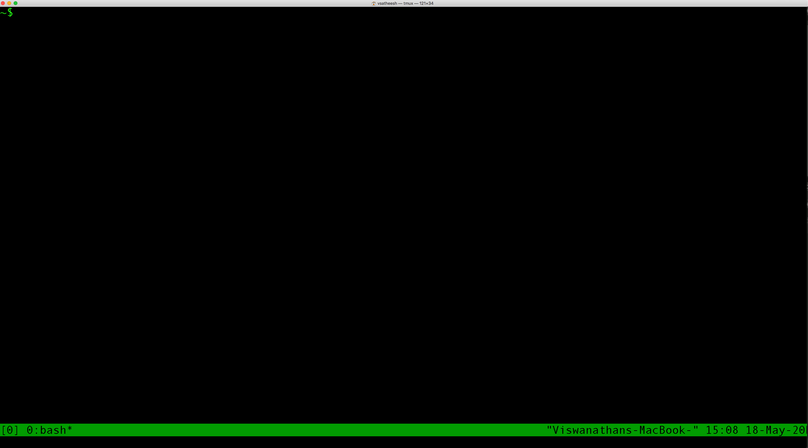
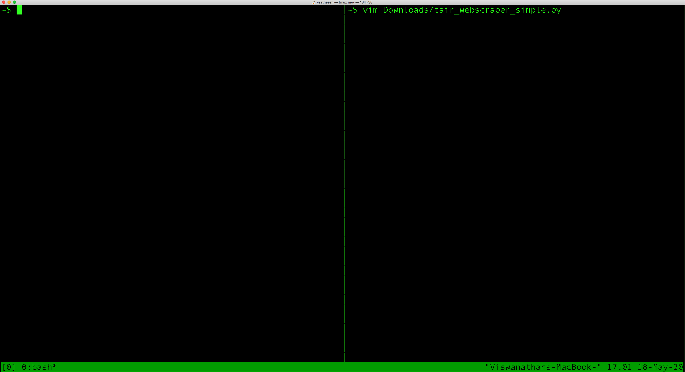
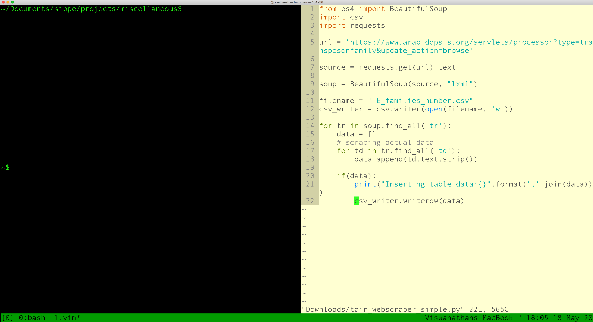
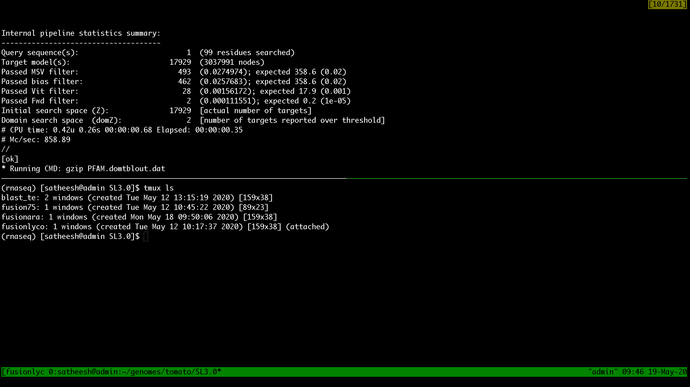

```{r setup, include=FALSE}
knitr::opts_chunk$set(echo = FALSE)
```
### Motivation to use Tmux
I am a plant geneticist and I analyse my own data. When I started, I was working on a stand-alone workstation and had more control over my environment. I used to work on multiple terminals and manually positioned them on the screen. Soon, managing multiple terminals turned out to be really tedious and a quick "Duckduckgo" search helped me discover "Tmux" or "Terminal Multiplexer". In fact, I found "Tmux" and "Screen" during the search, but after reading about both I decided to give "Tmux" a go and have continued to use it ever since. Later, when I started working on a server, I faced the same problem that everybody faces, I lost my session whenever the connection to the remote server was lost. This meant that my "flow of thought" was broken and I had to start all over again. By "losing a session" I do not mean "losing a running process", which can be managed by utilities such as **disown** and **nohup**. Whenever I continue with a session after a break, I run the last 20 or so commands from **history** and it gets me going right away. Therefore, preserving the entire session is also very important to me. Since I spend a lot of time on a terminal (a remote server mostly), I find using a terminal multiplexer, Tmux in this case, very convenient. 

In Tmux, one or more sessions can be started and these sessions are persistent and processes running in Tmux will continue to run even after you get disconnected from the remote server. In Tmux, we need to understand three parts: 

- Session
- Window 
- Pane

In a Tmux session, we can start multiple windows and each window can be split into multiple panes. Simply put, a session is a collection of Windows/Panes. In this first part, let us understand how to work with panes within a single window in a session. In the second part we can see how to manage multiple sessions and windows. 

### Installing Tmux
Installing on a Mac:

$ brew install tmux

Ubuntu or Debian:

$ sudo apt install tmux

CentOS or Fedora

$ sudo yum install tmux

Installation from source:

Taking the tmux-3.1b version as an example:

```{r, echo=TRUE, eval = F}
$ cd ~/src

$ wget https://github.com/tmux/tmux/releases/download/3.1b/tmux-3.1b.tar.gz

$ tar -zxvf tmux-3.1b.tar.gz

$ cd tmux-3.1b/

$ ./configure --prefix=$HOME/opt
```

Now that we have tmux installed, let us try it out. Open a terminal and type 

$ tmux

or 

$ tmux new



The above command brings you into tmux. You can see the command prompt and on the bottom of the terminal on the green bar you have something like [0] 0:bash\*. The [0] says that you are in the first session and this session can be named (we'll see this in the next part). The 0 following this says that we are in the first window. The asterisk after **bash** indicates that this is your active window. Once you are inside a tmux session, you can start using the terminal in much the same way as you would a normal bash terminal, assuming you are using the bash shell. So, we are now inside a tmux session with one window and one pane. 

#### Split Screen into 2 Panes:
For performing actions within Tmux, we use the prefix: Ctrl-b. For splitting the window into panes vertically we do:

Ctrl-b %


In the above figure, there are now two panes and I am trying to open a file with vim but do not execute the command. I want to switch back to the left pane before that. So, to switch panes:

Ctrl-b left-arrow

This moves the focus back to the left pane as shown in the figure below.



I now split the left pane horizontally so that we have two panes on the left and one on the right, where a python script is now open. For splitting the pane horizontally we do:

Ctrl-b " (single double quote)



Here, I want to impress on the fact that vim can be configured (solarized colour scheme with light background, in this case) within tmux. Tmux and Vim together can make the terminal a powerful IDE.

You can also switch between Panes by:

Ctrl-b o

#### List sessions

$ tmux ls

0: 1 windows (created Mon May 18 15:33:35 2020) (attached)

We have one session that is currently attached. Let us now create another named session but not attach it. 

$ tmux new -s test -d 

$ tmux ls

0: 1 windows (created Mon May 18 15:33:35 2020) (attached)

test: 1 windows (created Wed May 20 14:30:55 2020)

So, now we have two sessions, 0 and test and 0 is attached.

#### Detach from Session:

Ctrl-b d

With this command, the current session is detached and it keeps running in the background. From the command line, let us check the list of tmux sessions currently running using "tmux ls".

~$ tmux ls
0: 1 windows (created Mon May 18 15:33:35 2020)

test: 1 windows (created Wed May 20 14:30:55 2020)

Both sessions are detached now.

#### Re-attach to a Session:

tmux attach -t test

Now that we are inside the test session, let us create windows.

#### Create new Window:

Ctrl-b c

In the new window do:

$ tmux ls

0: 1 windows (created Mon May 18 15:33:35 2020)

test: 2 windows (created Wed May 20 14:30:55 2020) (attached)

We have 2 windows in the test session. 

#### Switch between Windows:

Ctrl-b p  # previous Window

Ctrl-b n  # next Window

### Switch between Sessions:

tmux switch -t 0

within Tmux:

Ctrl-b (      # switch the previous session

Ctrl-b )      # the next session

#### List all commands:

Ctrl-b ?   

#### This is my environment on a remote server



The above figure, the lower pane shows the dates and times when the different sessions were created and on the lower right corner on the green status bar, the time at which the screenshot was taken is shown.

One interesting thing I hope you would have noticed is that we can perform any and all required actions without ever having to move away from the keyboard for using a mouse making it a pretty powerful environment indeed. 

#### Rename current session from within Tmux:

$ tmux rename-session [new_name]

$ tmux list-sessions # list named sessions

